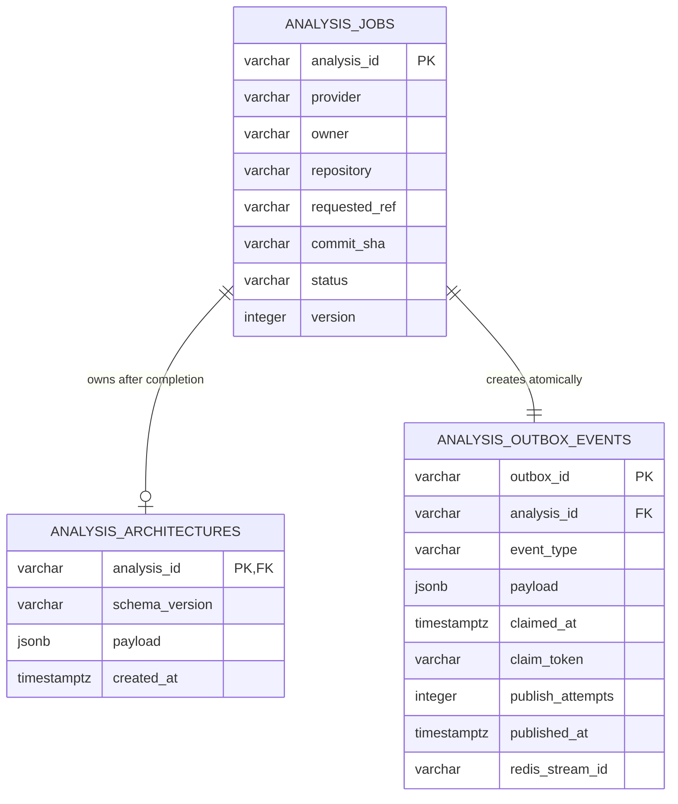

# Analysis job storage

- **Status:** Storage and transactional outbox implemented as isolated capabilities
- **Checkpoint:** 13
- **Database target:** PostgreSQL 17+
- **Migration head:** `0002_analysis_outbox`

RepoLume stores analysis lifecycle state separately from architecture results
and queue publication state. The repository and outbox publisher are tested,
but they are not connected to the HTTP job-service boundary yet.



## Job and architecture records

`analysis_jobs` is the durable source of truth for one attempt. Database checks
enforce known lifecycle states, paired safe failure fields, terminal timestamps,
commit SHA length, and unique analysis IDs. The `(status, created_at)` index
supports operational queries.

`analysis_architectures` stores one validated JSONB v1 artifact for a completed
job. Completion updates the job and inserts the graph in one transaction, so a
completed job cannot be committed without its result.

## Transactional outbox

`analysis_outbox_events` stores exactly one `analysis_requested` event per job.
`AnalysisStorage.create_job` inserts both rows in one transaction. If either
insert fails, neither survives.

Publishers lease available rows through `FOR UPDATE SKIP LOCKED`, commit that
short claim, and then call Redis outside the transaction. Successful publication
records the Redis Stream ID. A failed Redis call releases the claim; an
abandoned claim can be recovered after its timeout. The database constrains
publication timestamps and stream IDs to appear together.

This closes the lost-message window but intentionally provides at-least-once,
not exactly-once, delivery. See [ADR 0004](../decisions/0004-analysis-queue.md)
and [analysis request queue](../worker/analysis-queue.md).

## Lifecycle consistency

State changes use compare-and-set updates:

```text
UPDATE analysis_jobs
SET status = :next_status, version = version + 1
WHERE analysis_id = :id AND status = :expected_status
```

A zero-row update becomes a controlled missing-job or stale-worker conflict.
This also makes duplicate Redis delivery safe: only one delivery can advance a
job from a given expected state.

## Configuration and verification

`REPOLUME_DATABASE_URL` must use `postgresql+psycopg://` and contain a database
name. Diagnostic URL representations redact passwords.

Run migrations from `apps/api`:

```bash
python -m alembic upgrade head
python -m alembic check
```

Local unit tests use temporary SQLite databases for fast transaction coverage.
API CI starts PostgreSQL 17 and Redis, applies the real Alembic chain, checks
model/migration drift, runs repository tests against Psycopg, and verifies real
Redis publication.

## Intentional limitations

Checkpoint 13 does not include an HTTP `AnalysisJobService` adapter, a
continuously running publisher, pipeline result persistence, authentication or
ownership, retention jobs, backups, or production infrastructure.
