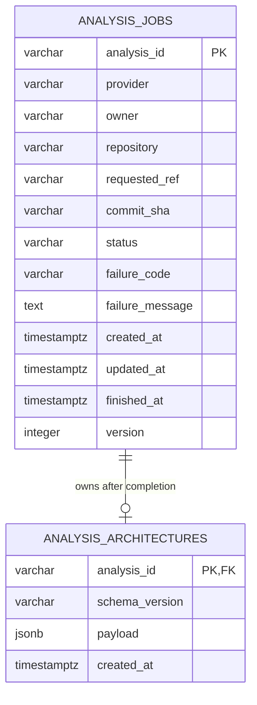

# Analysis job storage

- **Status:** Implemented as an isolated API capability
- **Checkpoint:** 12
- **Database target:** PostgreSQL 17+
- **Migration head:** `0001_analysis_storage`

RepoLume stores analysis lifecycle state separately from the complete
architecture graph. The storage repository is implemented and tested, but it is
not connected to the HTTP job-service boundary yet. Analysis submission still
fails safely until the queue checkpoint can make persistence and publication
one reliable operation.



## Job table

`analysis_jobs` is the durable source of truth for one analysis attempt. It
stores the normalized GitHub identity, requested ref, immutable commit SHA once
resolved, lifecycle status, safe failure details, timestamps, and an increasing
version number.

The database enforces:

- one of `queued`, `cloning`, `analyzing`, `completed`, or `failed`
- failure code and message together, and only for `failed`
- `finished_at` exactly for terminal jobs
- a 40-character commit SHA when one is present
- unique analysis identifiers

An index on `(status, created_at)` supports future worker claims and operations
queries without defining queue behavior in this checkpoint.

## Architecture table

`analysis_architectures` stores one JSONB document for a completed job. The
payload must pass the strict v1 API architecture schema before it enters a
transaction and again when it is read. The foreign key uses `ON DELETE CASCADE`
so a future retention operation cannot orphan large artifacts.

Graph data remains a versioned document because nodes, edges, evidence, and
summary counts are produced and consumed as one artifact. Frequently queried
job state remains relational instead of being buried inside JSON.

## Transaction rules

The storage repository uses short transactions and compare-and-set updates:

```text
UPDATE analysis_jobs
SET status = :next_status, version = version + 1
WHERE analysis_id = :id AND status = :expected_status
```

A zero-row update is either a missing job or a stale worker and becomes a
controlled error. Skipped, repeated, backward, and terminal-state transitions
are rejected before or during the transaction.

Completion updates the job and inserts its architecture inside one transaction.
If validation or insertion fails, the job remains `analyzing`; a completed job
cannot exist without the same transaction persisting its graph.

## Configuration

The API reads `REPOLUME_DATABASE_URL`. It must use the
`postgresql+psycopg://` driver and include a database name. Passwords are never
stored in repository configuration, and the diagnostic URL representation
redacts them.

Run migrations from `apps/api`:

```bash
python -m alembic upgrade head
```

Review PostgreSQL DDL without connecting:

```bash
python -m alembic upgrade head --sql
```

## Verification

Local integration tests use temporary SQLite databases to exercise transaction
and constraint behavior quickly. API CI starts PostgreSQL 17, applies the real
Alembic migration, and runs the same repository suite against Psycopg. Offline
verification also confirms the migration emits JSONB, constraints, indexes,
and cascading foreign keys.

## Intentional limitations

Checkpoint 12 does not include:

- an `AnalysisJobService` adapter
- queue publication, worker claims, acknowledgements, retries, or leases
- API submission enablement
- authentication, authorization, or ownership columns
- retention jobs, deletion endpoints, backups, or restore procedures
- connection deployment secrets or production infrastructure

Those boundaries remain explicit so adding storage cannot accidentally make the
API acknowledge work that no worker can receive.
