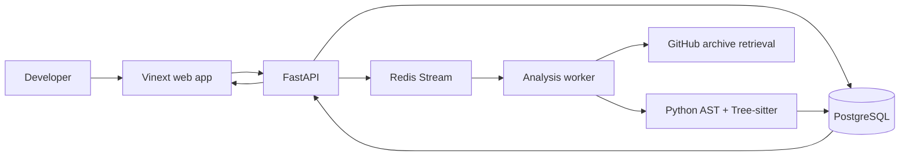
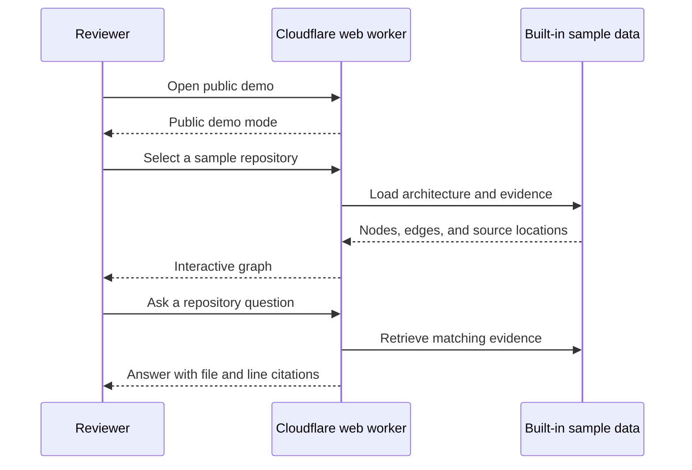

# RepoLume architecture

RepoLume turns a public GitHub repository into an interactive, source-linked
architecture model. The system is split into a web application, an API, and a
background analysis worker so each part can scale and fail independently.

## System overview

| Component | Responsibility | Current implementation |
| --- | --- | --- |
| Web | Repository submission, progress, graph exploration, and cited questions | Vinext, React, TypeScript, React Flow |
| API | Validation, durable job creation, status, architecture, and evidence contracts | FastAPI, SQLAlchemy, Alembic |
| Worker | Safe retrieval, parsing, relationship extraction, and result persistence | Python, Redis Streams, Python AST, Tree-sitter |
| PostgreSQL | Durable analysis requests and architecture artifacts | PostgreSQL 17 |
| Redis | At-least-once analysis job delivery and recovery | Redis Streams |

## Live public demo

The public Cloudflare deployment is intentionally sample-first:

No user repository is uploaded in public demo mode. The live-analysis form is
disabled unless a valid private `REPOLUME_API_URL` is configured.

## Full repository analysis flow

1. The web route validates the request and forwards it to FastAPI.
2. FastAPI records the request in PostgreSQL before publishing its identifier
   to Redis.
3. The worker retrieves the GitHub archive with redirect, size, file-count, and
   extraction limits.
4. Python files are parsed with the standard AST. TypeScript and JavaScript are
   parsed with Tree-sitter.
5. The worker creates modules, symbols, entry points, dependencies, source
   locations, and confidence-labelled relationships.
6. The architecture artifact is saved to PostgreSQL and the job becomes
   complete.
7. The web app retrieves the artifact and renders it with React Flow.
8. Repository questions rank static-analysis evidence and return cautious
   answers with numbered citations.

## Trust boundaries

- Repository URLs are limited to supported public GitHub locations.
- Retrieval rejects unsafe redirects, oversized downloads, excessive files,
  path traversal, and unsupported archive entries.
- The worker analyzes source without executing repository code.
- API responses have size limits and are validated at the web boundary.
- Public demo mode does not expose PostgreSQL, Redis, FastAPI, or the worker.
- Browser responses use a restrictive content policy, anti-framing headers,
  HSTS, and limited browser permissions.
- Deployment credentials stay in Cloudflare OAuth storage or GitHub production
  environment secrets, never in the repository.

## Reliability choices

- The database record is durable before a queue message is published.
- Redis Stream messages are acknowledged only after processing succeeds.
- Pending work can be recovered after a worker interruption.
- Worker operations have bounded time, size, and retry behavior.
- Sample repositories give reviewers a deterministic path when backend services
  are unavailable.

## Deployment

- Public web demo: Cloudflare Workers
- Local full stack: Docker Compose, Vinext, FastAPI, PostgreSQL, Redis, worker
- Continuous integration: separate web, API, and worker GitHub Actions jobs
- Architecture decisions: [`docs/decisions`](decisions/)
- Local runbook: [`docs/local-development.md`](local-development.md)

## Known boundaries

- The hosted demo currently uses built-in repositories.
- Repository answers are deterministic static-analysis summaries, not
  model-generated chat.
- Heuristic relationships are labelled separately from confirmed evidence.
- Security scoring, maintainability scoring, and pull-request analysis remain
  roadmap work rather than finished features.
