# Checkpoint verification evidence

These screenshots record fresh local verification runs for reviewed project
checkpoints. Each image includes the branch, result, and capture date.

## Checkpoint 6

### API pytest

Command: `python -m pytest` from `apps/api`

Result: 55 tests passed.

### Worker pytest

Command: `python -m pytest` from `apps/worker`

Result: 48 tests passed.

## Checkpoint 7

Branch: `feature/python-analysis`

Captured: August 1, 2026

### API pytest

Command: `python -m pytest` from `apps/api`

Result: 55 tests passed in 0.55 seconds.

### Worker pytest

Command: `python -m pytest` from `apps/worker`

Result: 70 tests passed in 0.70 seconds.

The screenshots are documentation artifacts rendered from the exact output of
fresh local runs. GitHub Actions remains the authoritative CI record after the
branch is pushed.

## Checkpoint 8

Branch: `feature/typescript-analysis`

Captured: August 2, 2026

### API pytest

Command: `python -m pytest` from `apps/api`

Result: 55 tests passed in 0.57 seconds.

### Worker pytest

Command: `python -m pytest` from `apps/worker`

Result: 98 tests passed in 0.48 seconds.

The screenshots are documentation artifacts rendered from the exact output of
fresh local runs. GitHub Actions remains the authoritative CI record after the
branch is pushed.

## Checkpoint 8.1

Branch: `feature/typescript-analysis-hardening`

Captured: August 2, 2026

### API pytest

Command: `python -m pytest` from `apps/api`

Result: 55 tests passed in 0.85 seconds.

### Worker pytest

Command: `python -m pytest` from `apps/worker`

Result: 100 tests passed in 0.75 seconds.

The screenshots are documentation artifacts rendered from the exact output of
fresh local runs. GitHub Actions remains the authoritative CI record after the
branch is pushed.

## Checkpoint 9

Branch: `feature/architecture-artifact`

Captured: August 3, 2026

### API pytest

Command: `python -m pytest` from `apps/api`

Result: 55 tests passed in 0.75 seconds.

### Worker pytest

Command: `python -m pytest` from `apps/worker`

Result: 117 tests passed in 0.81 seconds.

The screenshots are documentation artifacts rendered from the exact output of
fresh local runs. GitHub Actions remains the authoritative CI record after the
branch is pushed.

## Checkpoint 10

Branch: `feature/analysis-pipeline`

Captured: August 3, 2026

### API pytest

Command: `python -m pytest` from `apps/api`

Result: 55 tests passed in 0.63 seconds.

### Worker pytest

Command: `python -m pytest` from `apps/worker`

Result: 128 tests passed in 0.93 seconds.

The screenshots are documentation artifacts rendered from the exact output of
fresh local runs. GitHub Actions remains the authoritative CI record after the
branch is pushed.

## Checkpoint 11

Branch: `feature/analysis-api`

Captured: August 3, 2026

### API pytest

Command: `python -m pytest` from `apps/api`

Result: 71 tests passed in 1.05 seconds.

### Worker pytest

Command: `python -m pytest` from `apps/worker`

Result: 128 tests passed in 0.77 seconds.

The screenshots are documentation artifacts rendered from the exact output of
fresh local runs. GitHub Actions remains the authoritative CI record after the
branch is pushed.

## Checkpoint 12

Branch: `feature/analysis-storage`

Captured: August 3, 2026

### API pytest

Command: `python -m pytest` from `apps/api`

Result: 96 tests passed in 4.90 seconds.

### Worker pytest

Command: `python -m pytest` from `apps/worker`

Result: 128 tests passed in 1.47 seconds.

The screenshots are documentation artifacts rendered from the exact output of
fresh local runs. GitHub Actions remains the authoritative CI record after the
branch is pushed. API CI also applies the PostgreSQL migration, checks model
and migration drift, and runs storage tests against PostgreSQL 17.

## Checkpoint 13

Branch: `feature/analysis-queue`

Captured: August 3, 2026

### API pytest

Command: `python -m pytest` from `apps/api`

Result: 115 tests passed in 2.45 seconds; the live Redis integration test is
separated for CI.

### Worker pytest

Command: `python -m pytest` from `apps/worker`

Result: 158 tests passed in 1.13 seconds; the live Redis integration test is
separated for CI.

The screenshots are documentation artifacts rendered from the exact output of
fresh local runs. GitHub Actions starts Redis 8.8.1 and runs the separated API
publisher and worker consumer-group integration tests. API CI also applies the
PostgreSQL migration and checks model/migration drift.

## Checkpoint 14

Branch: `feature/analysis-runtime`

Captured: August 3, 2026

### API pytest

Command: `python -m pytest` from `apps/api`

Result: 127 tests passed in 3.66 seconds; the live Redis integration test is
separated for CI.

### Worker pytest

Command: `python -m pytest` from `apps/worker`

Result: 181 tests passed in 2.30 seconds; the live Redis and PostgreSQL
integration tests are separated for CI.

The screenshots are documentation artifacts rendered from the exact output of
fresh local runs. GitHub Actions starts PostgreSQL 17 and Redis 8.8.1, then
verifies real queue delivery, durable completion, and acknowledgement.

## Checkpoint 15

Branch: `feature/web-analysis-flow`

Captured: August 12, 2026

### API pytest

Command: `python -m pytest` from `apps/api`

Result: 127 tests passed in 7.11 seconds; the live Redis integration test is
separated for CI.

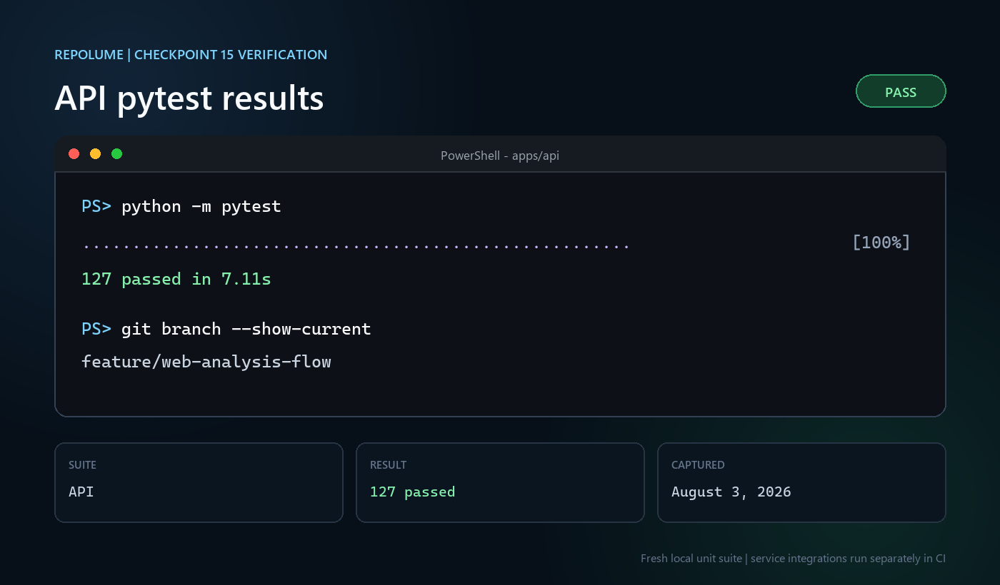

### Worker pytest

Command: `python -m pytest` from `apps/worker`

Result: 181 tests passed in 6.71 seconds; the live Redis and PostgreSQL
integration tests are separated for CI.

The web verification also completed a production Vinext build, five rendered
and route-level tests, ESLint, a zero-vulnerability production dependency
audit, and desktop and mobile browser checks.

## Checkpoint 16

Branch: `feature/architecture-explorer`

Captured: August 12, 2026

### API pytest

Command: `python -m pytest` from `apps/api`

Result: 127 tests passed in 2.60 seconds; the live Redis integration test is
separated for CI.

### Worker pytest

Command: `python -m pytest` from `apps/worker`

Result: 181 tests passed in 1.55 seconds; the live Redis and PostgreSQL
integration tests are separated for CI.

The web verification also completed a production Vinext build, five rendered
and route-level tests, ESLint, a zero-vulnerability production dependency
audit, and an end-to-end browser check from repository submission through
source-evidence node selection.

## Checkpoint 17

Branch: `feature/repository-chat-foundation`

Captured: August 26, 2026

### API pytest

Command: `python -m pytest` from `apps/api`

Result: 137 tests passed in 2.27 seconds; the live Redis integration test is
separated for CI.

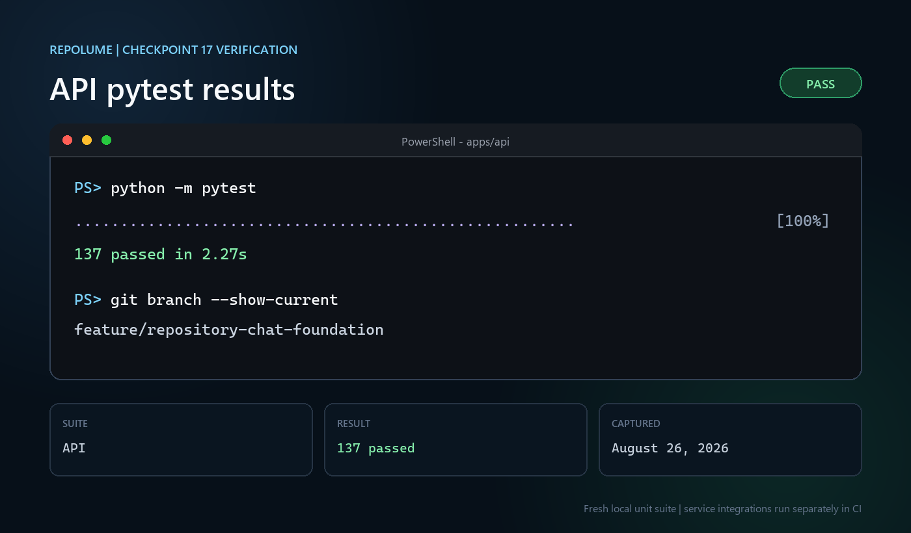

### Worker pytest

Command: `python -m pytest` from `apps/worker`

Result: 181 tests passed in 3.13 seconds; the live Redis and PostgreSQL
integration tests are separated for CI.

The web verification completed a production Vinext build, six rendered and
route-level tests, ESLint, a zero-vulnerability production dependency audit,
and desktop and mobile browser checks covering repository submission, graph
loading, evidence querying, and source-line rendering.

## Checkpoint 18

Branch: `feature/repository-chat`

Captured: August 28, 2026

### API pytest

Command: `python -m pytest -p no:cacheprovider` from `apps/api`

Result: 145 tests passed in 5.26 seconds; the live Redis integration test is
separated for CI.

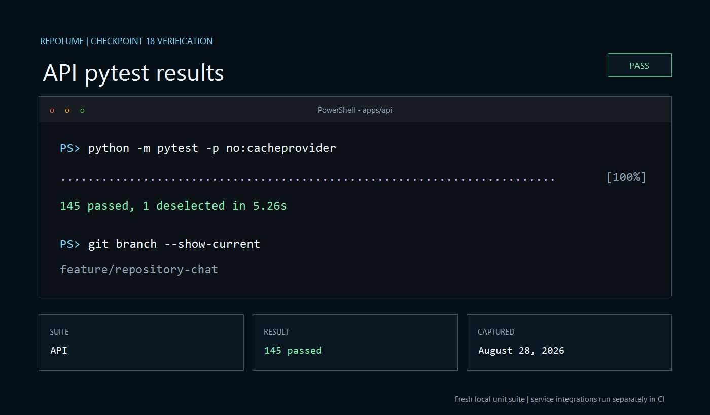

### Worker pytest

Command: `python -m pytest -p no:cacheprovider` from `apps/worker`

Result: 181 tests passed in 3.77 seconds; the live Redis and PostgreSQL
integration tests are separated for CI.

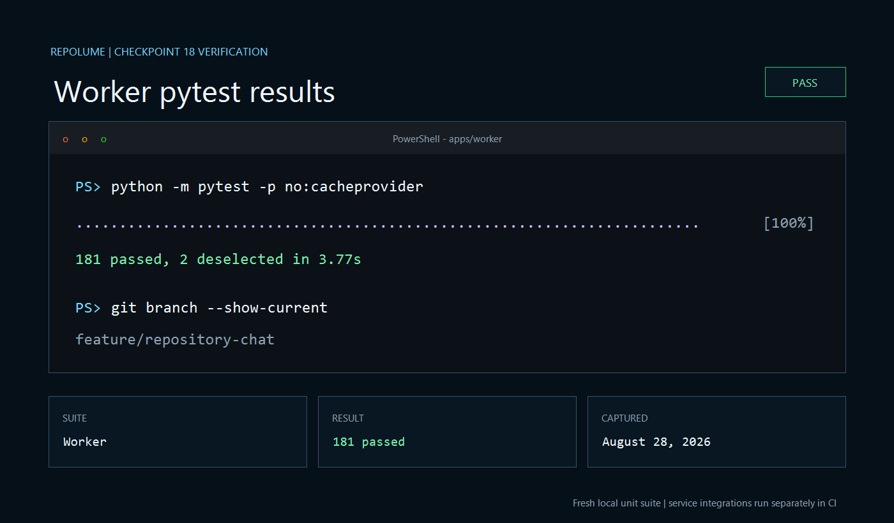

The web verification completed a production Vinext build, seven rendered and
route-level tests, ESLint, a zero-vulnerability production dependency audit,
and desktop and mobile browser checks covering repository submission, graph
loading, grounded repository answers, and source citation rendering.

## Checkpoint 19

Branch: `feature/sample-repositories`

Captured: August 29, 2026

### API pytest

Command: `python -m pytest -p no:cacheprovider` from `apps/api`

Result: 145 tests passed in 4.69 seconds; the live Redis integration test is
separated for CI.

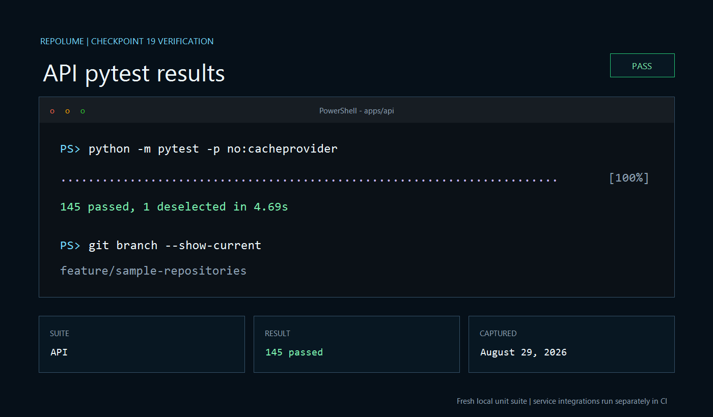

### Worker pytest

Command: `python -m pytest -p no:cacheprovider` from `apps/worker`

Result: 181 tests passed in 2.23 seconds; the live Redis and PostgreSQL
integration tests are separated for CI.

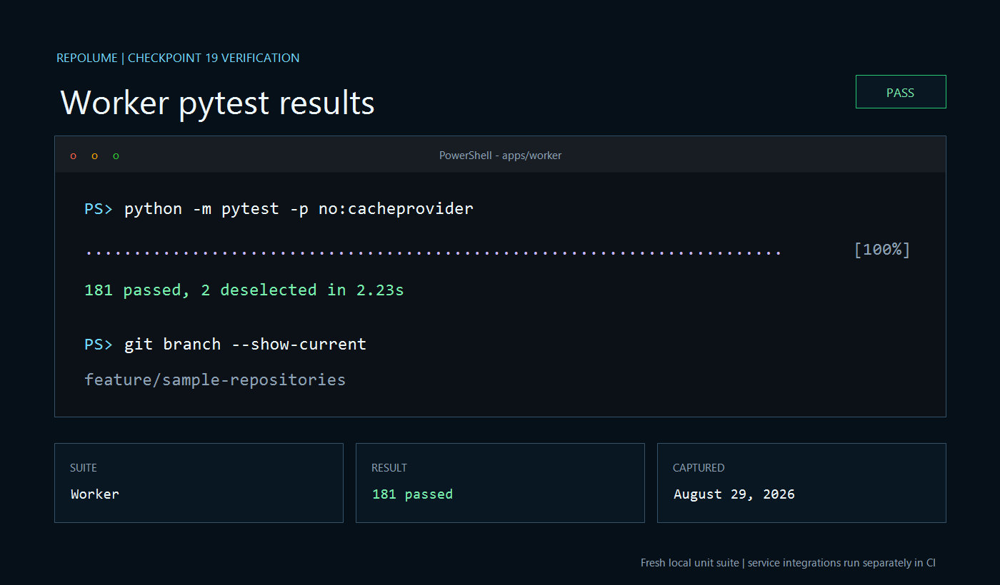

The web verification completed a production Vinext build, eight rendered and
route-level tests, ESLint, and a zero-vulnerability production dependency
audit. Browser automation was not used for this checkpoint because the local
preview URL was blocked by the browser controller policy during verification.

## Checkpoint 20

Branch: `feature/demo-polish`

Captured: September 2, 2026

### API pytest

Command: `python -m pytest -p no:cacheprovider` from `apps/api`

Result: 145 tests passed in 2.93 seconds; the live Redis integration test is
separated for CI.

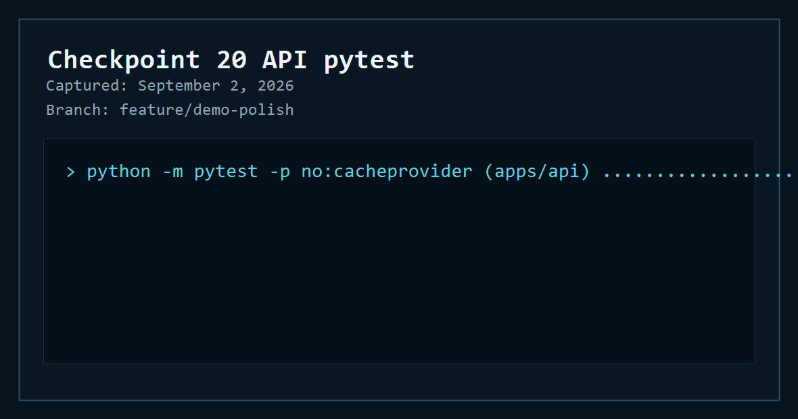

### Worker pytest

Command: `python -m pytest -p no:cacheprovider` from `apps/worker`

Result: 181 tests passed in 4.54 seconds; the live Redis and PostgreSQL
integration tests are separated for CI.

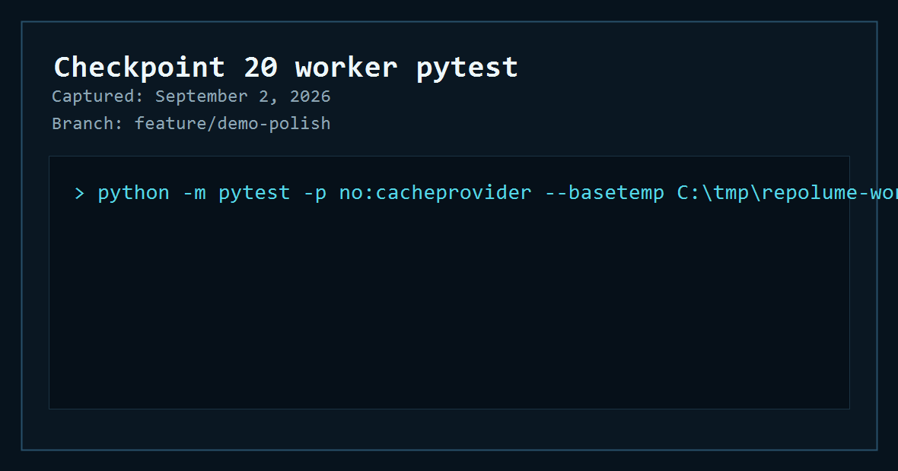

The web verification completed a production Vinext build, eight rendered and
route-level tests, ESLint, and a zero-vulnerability production dependency
audit.

## Checkpoint 21

Branch: `feature/local-analysis-flow`

Captured: September 3, 2026

### API pytest

Command: `python -m pytest -p no:cacheprovider` from `apps/api`

Result: 145 tests passed in 2.85 seconds; the live Redis integration test is
separated for CI.

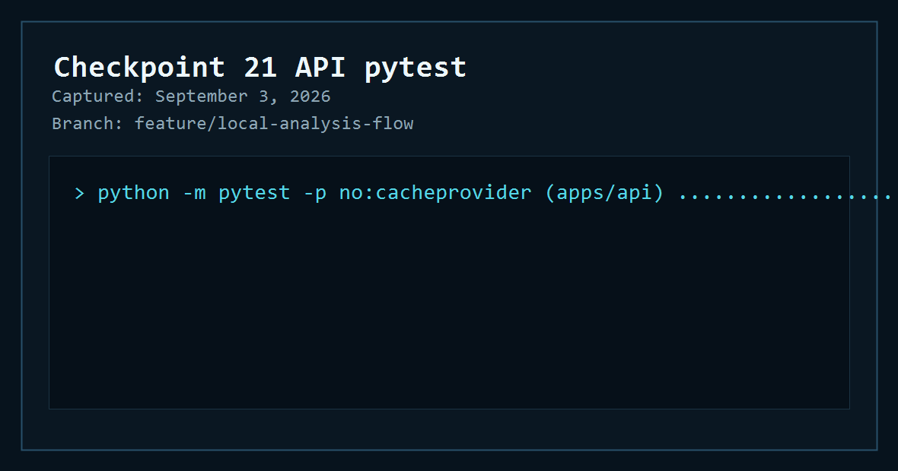

### Worker pytest

Command: `python -m pytest -p no:cacheprovider` from `apps/worker`

Result: 182 tests passed in 1.85 seconds; the live Redis and PostgreSQL
integration tests are separated for CI.

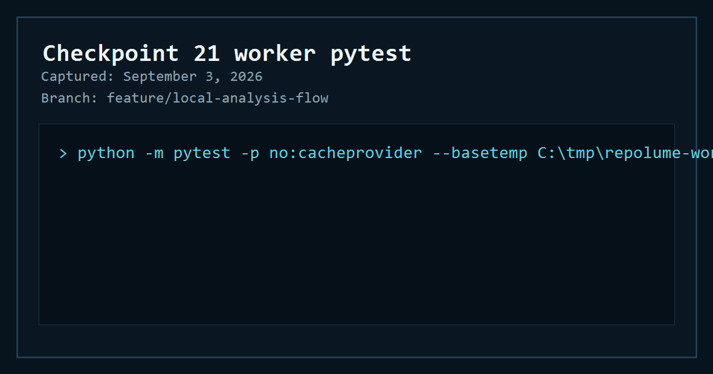

The web verification completed a production Vinext build, eight rendered and
route-level tests, ESLint, API Ruff, worker Ruff, and Docker Compose config
validation. The production dependency audit was attempted, but the registry
call did not return useful output before it was stopped; package files were not
changed in this checkpoint.

## Checkpoint 22

Branch: `feature/local-e2e-verification`

Captured: September 17, 2026

### API pytest

Command: `python -m pytest -p no:cacheprovider` from `apps/api`

Result: 145 tests passed and one live integration test was deselected in 12.28
seconds.

Command: `python -m pytest -p no:cacheprovider -m integration` with the local
Redis test URL configured

Result: one live Redis integration test passed in 1.60 seconds.

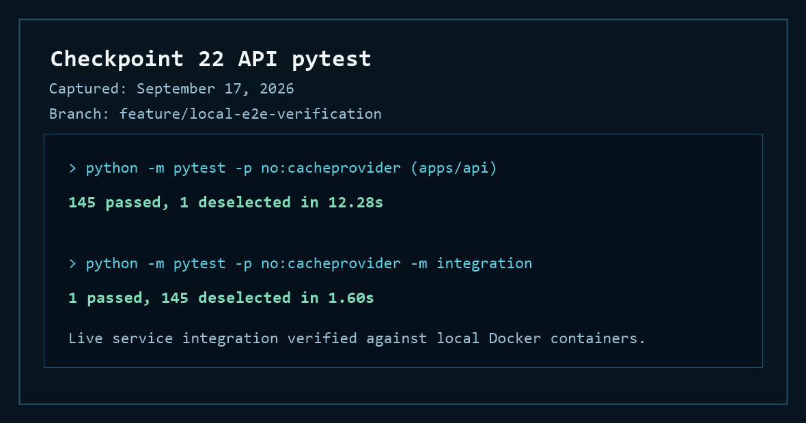

### Worker pytest

Command: `python -m pytest -p no:cacheprovider` from `apps/worker`

Result: 182 tests passed and two live integration tests were deselected in 6.76
seconds.

Command: `python -m pytest -p no:cacheprovider -m integration` with dedicated
local PostgreSQL and Redis test URLs configured

Result: two live service integration tests passed in 0.86 seconds.

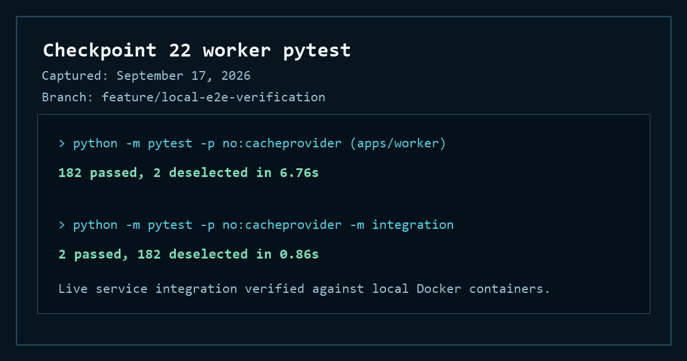

### Real repository flow

The browser submitted `https://github.com/pallets/itsdangerous` through the
live Vinext, FastAPI, PostgreSQL, Redis, and worker stack. The job reached
`COMPLETED` and rendered an architecture with 79 nodes, 15 modules, 43 symbols,
and 80 dependencies. The question “Where is signing implemented?” returned a
grounded answer citing `src/itsdangerous/signer.py:15-28`.

Browser verification found no console warnings, console errors, or framework
error overlays. The production Vinext build, eight rendered and route-level
tests, ESLint, API Ruff, and worker Ruff also passed.

## Checkpoint 23

Branch: `feature/public-demo-deployment`

Captured: September 18, 2026

### Public demo deployment readiness

Command: `npm test` from `apps/web`

Result: the production Vinext worker build completed and all nine rendered-page
and route-level tests passed.

Command: `npm run deploy:dry-run` from `apps/web`

Result: Wrangler validated a 1,642.65 KiB upload bundle with 26 static assets
and exited without publishing.

Command: `npm run smoke -- http://localhost:3000` from `apps/web`

Result: the page, `/api/health`, and the commerce sample all passed the live
smoke test. ESLint and the production dependency audit also passed with zero
vulnerabilities.

Command: `npm run smoke -- https://repolume-web.sukhnoor-repolume.workers.dev`

Result: the deployed Cloudflare Worker passed the same page, health, and sample
checks over HTTPS. Deployment version `16cdbad2-c9a6-4287-a6dc-95719bc1288f`
was published successfully.

Test screenshots were intentionally omitted for this checkpoint. Verification
is reproducible through the commands above and the manual deployment workflow.

## Checkpoint 24

Branch: `feature/portfolio-launch`

Captured: September 18, 2026

### Portfolio launch and security review

Command: `npm test` from `apps/web`

Result: the production Vinext worker build completed and all nine rendered-page
and route-level tests passed, including the browser security-header checks.

Command: `python -m pytest -p no:cacheprovider` from each Python application

Result: 145 API tests and 182 worker tests passed. The three service-backed
integration checks remain separated and were last verified in Checkpoint 22.

Command: `npm audit --omit=dev` and `npm run deploy:dry-run` from `apps/web`

Result: npm reported zero production vulnerabilities and Wrangler validated the
production bundle without publishing it. ESLint also completed successfully.

Command: `npm run smoke -- https://repolume-web.sukhnoor-repolume.workers.dev`

Result: the redeployed Cloudflare Worker passed page, health, and sample checks.
Deployment version `baab4d4d-8f95-48e6-8792-3aece08315e2` serves CSP, HSTS,
anti-framing, MIME-sniffing, referrer, cross-origin, and browser-permission
headers. A fresh browser walkthrough loaded the commerce graph and returned two
source citations without console errors.

The repository remained private during this review. GitHub Actions were limited
to GitHub-owned actions pinned to immutable commits, workflow tokens remained
read-only, and only the repository owner had collaborator access. Screenshots
were intentionally omitted; the commands above are reproducible.
