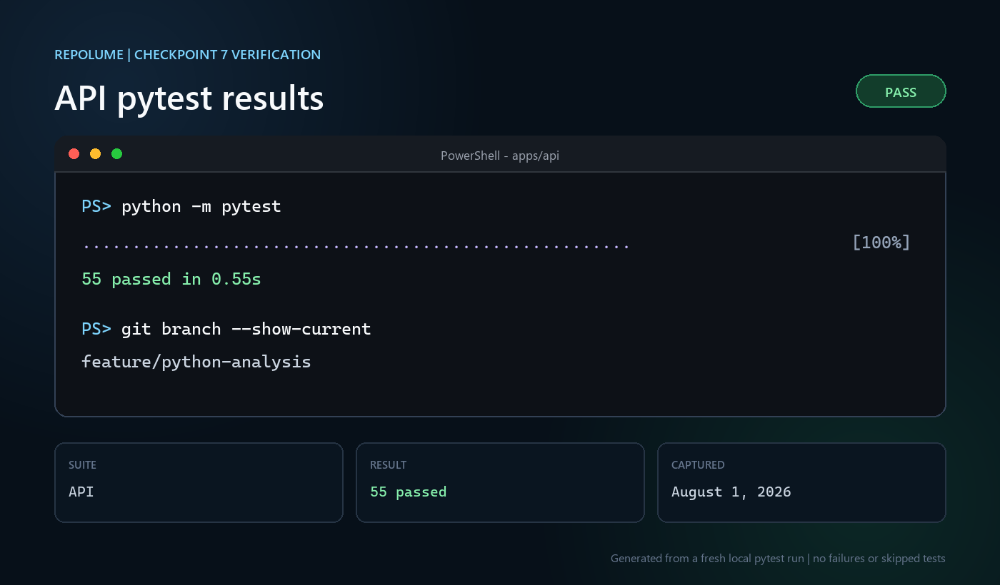

# Checkpoint verification evidence

These screenshots record fresh local verification runs for reviewed project
checkpoints. Each image includes the branch, result, and capture date.

## Checkpoint 6

### API pytest

Command: `python -m pytest` from `apps/api`

Result: 55 tests passed.

### Worker pytest

Command: `python -m pytest` from `apps/worker`

Result: 48 tests passed.

## Checkpoint 7

Branch: `feature/python-analysis`

Captured: August 1, 2026

### API pytest

Command: `python -m pytest` from `apps/api`

Result: 55 tests passed in 0.55 seconds.

### Worker pytest

Command: `python -m pytest` from `apps/worker`

Result: 70 tests passed in 0.70 seconds.

The screenshots are documentation artifacts rendered from the exact output of
fresh local runs. GitHub Actions remains the authoritative CI record after the
branch is pushed.

## Checkpoint 8

Branch: `feature/typescript-analysis`

Captured: August 2, 2026

### API pytest

Command: `python -m pytest` from `apps/api`

Result: 55 tests passed in 0.57 seconds.

### Worker pytest

Command: `python -m pytest` from `apps/worker`

Result: 98 tests passed in 0.48 seconds.

The screenshots are documentation artifacts rendered from the exact output of
fresh local runs. GitHub Actions remains the authoritative CI record after the
branch is pushed.

## Checkpoint 8.1

Branch: `feature/typescript-analysis-hardening`

Captured: August 2, 2026

### API pytest

Command: `python -m pytest` from `apps/api`

Result: 55 tests passed in 0.85 seconds.

### Worker pytest

Command: `python -m pytest` from `apps/worker`

Result: 100 tests passed in 0.75 seconds.

The screenshots are documentation artifacts rendered from the exact output of
fresh local runs. GitHub Actions remains the authoritative CI record after the
branch is pushed.
