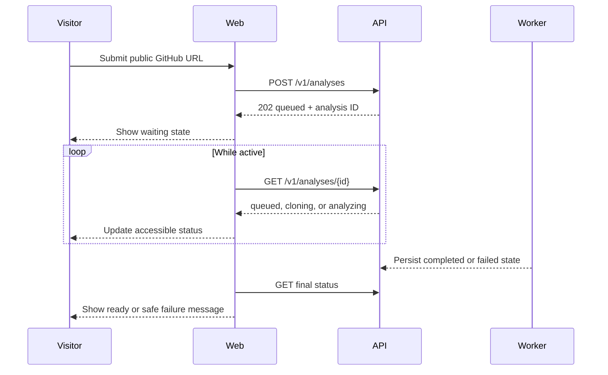

# Web analysis submission

- **Status:** Implemented
- **Checkpoint:** 15
- **Boundary:** Same-origin proxy to FastAPI v1

Checkpoint 15 turns the landing-page repository field into the first real
product workflow. A visitor can submit a public GitHub repository and watch its
durable analysis move through the worker lifecycle.



## Configuration

Set the server-side web setting to the FastAPI origin:

```text
REPOLUME_API_URL=http://127.0.0.1:8000
```

No API address is embedded in the client bundle. Without the setting, the web
route returns `503 analysis_service_unavailable` and the form shows the safe
message supplied by that boundary.

## Interaction rules

- The form uses native URL validation and requires a non-empty value.
- FastAPI remains authoritative for GitHub repository and ref normalization.
- Status is announced through an `aria-live` region without moving keyboard
  focus.
- Polling stops on `completed`, `failed`, transport failure, malformed JSON, or
  component cleanup.
- Only the API's safe failure message is displayed; raw exceptions and internal
  addresses are never rendered.

## Intentional limitations

This checkpoint does not fetch or visualize the completed architecture. It also
does not add authentication, job ownership, cancellation, manual retry,
progress percentages, streaming, saved analyses, or production deployment.
