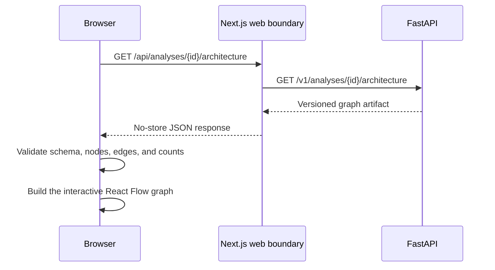

# Interactive architecture explorer

- **Status:** Implemented
- **Checkpoint:** 16
- **Artifact schema:** 1.0

RepoLume now turns a completed repository analysis into an interactive graph.
The landing page keeps its sample map until a visitor submits a public GitHub
repository and the worker finishes the analysis.

## Explorer behavior

- Repository, module, symbol, entry-point, and external-dependency nodes use
  stable artifact IDs.
- Confirmed relationships are cyan. Heuristic relationships are amber and
  dashed so the interface does not present inference as certainty.
- Selecting a node opens its language, relationship count, confidence, and
  repository-relative source location.
- Zoom, pan, fit-view controls, and a minimap support larger repositories.
- The browser renders at most 150 nodes at once and reports when the artifact
  was truncated for interaction performance.
- A deterministic kind-column layout keeps the first version predictable
  without adding a second layout engine.

## Trust boundary

The browser does not treat the API response as trusted component state. It
accepts only schema version `1.0`, known node and edge kinds, valid source line
ranges, unique node and edge IDs, relationships whose endpoints exist, and
summary counts that match the returned collections. Invalid artifacts produce
a safe message and leave the sample experience available.

The same-origin proxy continues to hide the API topology, reject oversized or
malformed JSON, disable caching, and replace upstream connection details with a
safe error envelope.

## Intentional limitations

This checkpoint visualizes the existing static-analysis artifact. It does not
add automatic service clustering, method-level call graphs, animated request
traces, generated repository answers, technical-debt scoring, security
findings, saved analyses, or production deployment.
