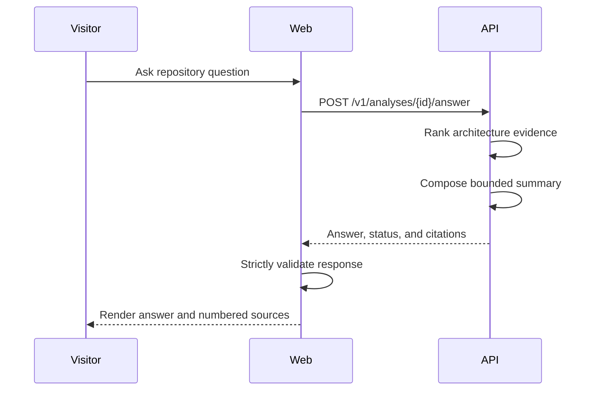

# Grounded repository answers

- **Status:** Implemented
- **Checkpoint:** 18

The repository question panel now displays a concise answer before its source
cards. The answer status clearly distinguishes supported results from questions
that lack enough architecture evidence.

The web route validates the question before proxying it to FastAPI. The browser
also validates every response field before rendering. Answer text is rendered
as plain React content, so repository-controlled metadata cannot inject HTML.

The panel is stateless, cancels replaced requests, reports network and contract
errors safely, and remains responsive on mobile. It does not imply that the
current static-analysis summary is an LLM response.
