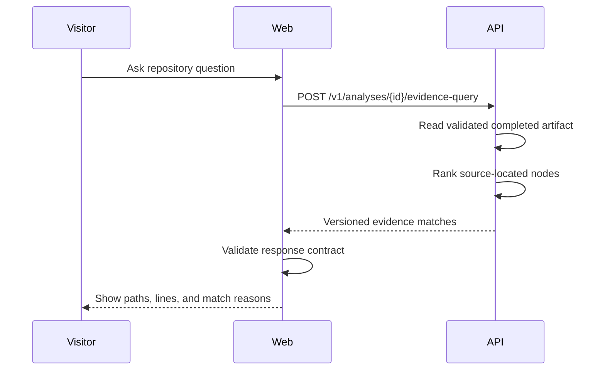

# Repository evidence search

- **Status:** Implemented
- **Checkpoint:** 17

After a repository architecture loads, the web experience reveals a question
panel below the graph. The panel calls the same-origin evidence route and shows
ranked source matches with file paths, line ranges, matched terms,
relationship counts, and confidence.

The interface explicitly labels this as evidence search and states that no
answer has been generated yet. Empty results are not converted into a guessed
response, and malformed service responses produce a safe error message.

The question form is unavailable until a completed architecture is loaded. It
does not store conversation history, send source to an LLM, stream tokens, or
claim that evidence matches are a complete answer.
