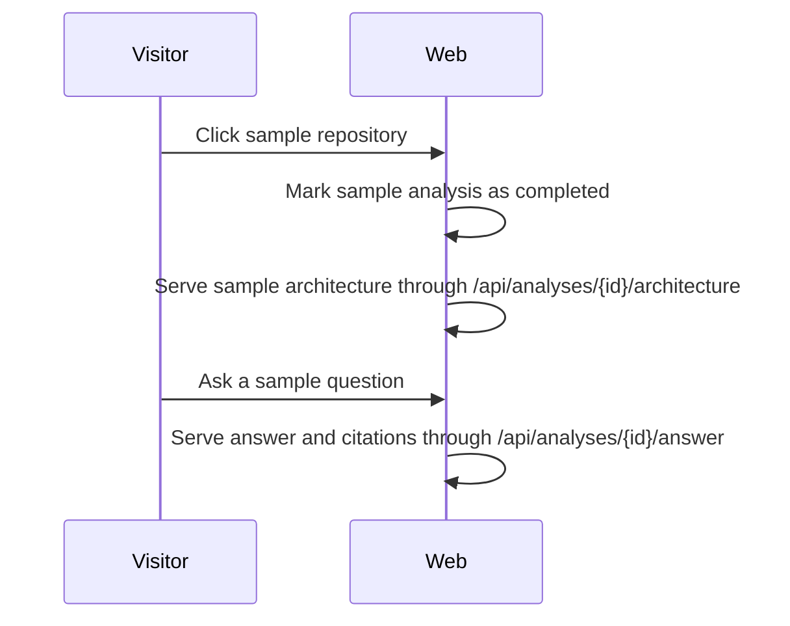

# Sample repositories

- **Status:** Implemented
- **Checkpoint:** 19

RepoLume now includes two built-in sample repositories on the main analyzer
surface:

- Commerce platform, a TypeScript order-service example
- Task API, a Python route/auth example

These samples are meant for demos and portfolio review. They let someone open
the app, load an architecture map, and ask a source-cited question without
signing up, waiting for a worker, or configuring `REPOLUME_API_URL`.

## Flow

The sample routes use the same response shape as the live API proxy routes.
Unknown analysis identifiers still fall through to the configured FastAPI
origin, so the sample path does not replace real repository analysis.

## Limits

Samples are static fixtures. They are useful for the first-click demo, but they
do not represent a real GitHub clone, worker run, source scan, or LLM response.
The UI keeps them close to the live workflow so they can be removed or replaced
with saved real analyses later.
