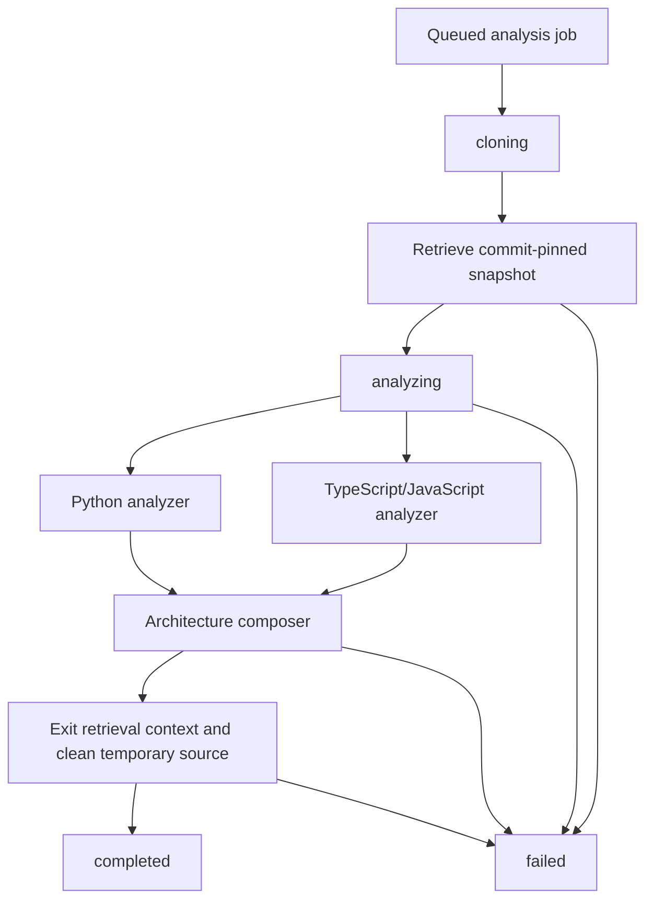

# Repository analysis pipeline

- **Status:** Connected to the bounded worker runtime
- **Checkpoint:** 14
- **Result schema:** 1.0

The repository analysis pipeline connects RepoLume's secure retrieval, source
analyzers, and architecture composer into one complete in-memory worker run. It
accepts a queued job and normalized GitHub coordinates, and returns only after
the temporary repository has been cleaned up successfully.



## Successful result

A completed version 1 result contains:

- the analysis identifier and terminal `completed` status
- the full ordered lifecycle history
- provider, owner, repository, requested ref, and immutable commit SHA
- archive file count and expanded byte count
- the language-neutral repository architecture artifact

The temporary archive and extraction path are deliberately absent. Result JSON
contains repository-relative evidence only and remains usable after the
retrieval context exits.

## Lifecycle rules

The pipeline accepts an `AnalysisJob` in `queued` state and records:

```text
queued -> cloning -> analyzing -> completed
```

A retrieval failure records:

```text
queued -> cloning -> failed
```

Analysis, composition, or cleanup failures record:

```text
queued -> cloning -> analyzing -> failed
```

A job that is not queued is rejected before repository retrieval. Completion is
recorded only after the retrieval context exits. If temporary cleanup fails,
the run is failed and never exposes a completed result.

## Failure contract

Controlled retrieval and source-analysis failures preserve their existing safe
code and message. Invalid internal architecture composition is mapped to
`architecture_composition_failed`. Any other exception is mapped to
`analysis_failed` with a generic user-safe message.

The raised pipeline error includes:

- analysis identifier
- safe machine-readable code
- safe message
- terminal `failed` status
- lifecycle history

Raw parser details, response bodies, source contents, credentials, temporary
paths, and exception text are not copied into the safe message. The original
exception remains available only as the in-process cause for logs that apply
their own redaction policy.

## Dependency boundaries

The pipeline requires a repository retriever and uses the production Python
analyzer, TypeScript/JavaScript analyzer, and architecture composer by default.
Each boundary can be replaced in tests, so regression tests use an isolated
fake retrieval context and never depend on live GitHub access.

The production retriever still owns network validation, archive limits,
extraction safety, and physical cleanup. The pipeline owns ordering, lifecycle,
result construction, and safe cross-boundary failure behavior.

## Runtime integration

An optional lifecycle observer now persists `cloning` before retrieval and
`analyzing` with the immutable commit SHA before parsing. The worker runtime
persists terminal failure or completion and acknowledges Redis only afterward.
The pipeline remains independently testable because observation is injected.

Runtime ownership, duplicate handling, and stale recovery are documented in
[analysis runtime wiring](analysis-runtime.md).

## Intentional limitations

The connected pipeline still does not include authentication, authorization,
job ownership, progress streaming, cancellation, heartbeat renewal,
container-level outbound policy, deployment supervision, UI visualization, or
AI features.
