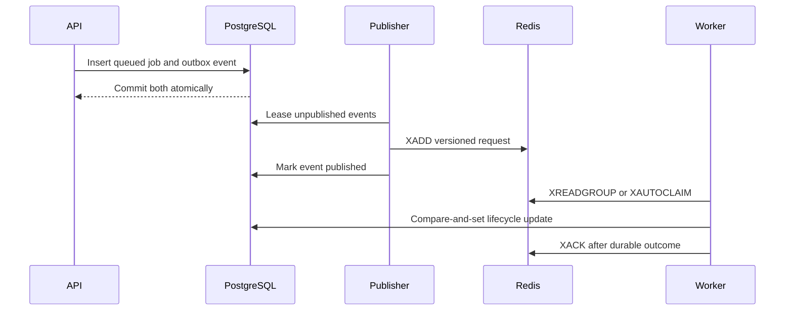

# Analysis request queue

- **Status:** Queue primitives implemented; runtime wiring deferred
- **Checkpoint:** 13
- **Delivery:** At least once
- **Broker:** Redis Streams

Checkpoint 13 establishes the reliable boundary between durable analysis jobs
and asynchronous workers. It does not enable HTTP analysis submission or start
a production worker loop yet.

## Message contract

The `repolume:analysis:requests` stream contains only these string fields:

| Field | Meaning |
| --- | --- |
| `schema_version` | Currently `1.0` |
| `event_id` | UUID of the PostgreSQL outbox row |
| `analysis_id` | Safe analysis job identifier |
| `provider` | Currently `github` |
| `owner` | Normalized GitHub owner |
| `repository` | Normalized GitHub repository |
| `ref` | Requested ref, or an empty string |

The worker rejects missing, extra, unversioned, or malformed fields with a
controlled error that does not include submitted values. A runtime handler may
acknowledge a deliberately discarded malformed message by ID.

## Publication and recovery

The API inserts the job and event in one PostgreSQL transaction. Publishers
claim batches through short leases and never keep a database transaction open
while waiting for Redis. Failed writes release the claim immediately; claims
left by a stopped publisher become eligible after the lease timeout.

Workers create one consumer group idempotently, read new entries, and can
reclaim entries idle beyond the configured threshold. Acknowledgement is
explicit. If acknowledgement does not apply to one pending entry, the worker
receives a conflict instead of assuming success.

A stop between `XADD` and marking the event published can produce a duplicate.
This is intentional at-least-once behavior. The durable lifecycle repository's
compare-and-set transitions prevent two deliveries from advancing the same job
from the same expected state.

## Configuration

Both applications require `REPOLUME_REDIS_URL` when their queue adapter is
constructed. Optional settings are:

- `REPOLUME_ANALYSIS_STREAM`
- `REPOLUME_ANALYSIS_CONSUMER_GROUP` (worker)
- `REPOLUME_ANALYSIS_CLAIM_IDLE_MS` (worker, minimum 1000)

Redis passwords are excluded from object representations and diagnostic URLs.
CI starts Redis and runs separate integration tests for publication and
consumer-group acknowledgement.

## Intentional limitations

Checkpoint 13 does not include the HTTP job-service adapter, a continuously
running publisher or worker process, pipeline result persistence, dead-letter
streams, bounded retry/backoff policy, cancellation, or deployment secrets.
Those pieces are added only after this boundary is reviewed.
