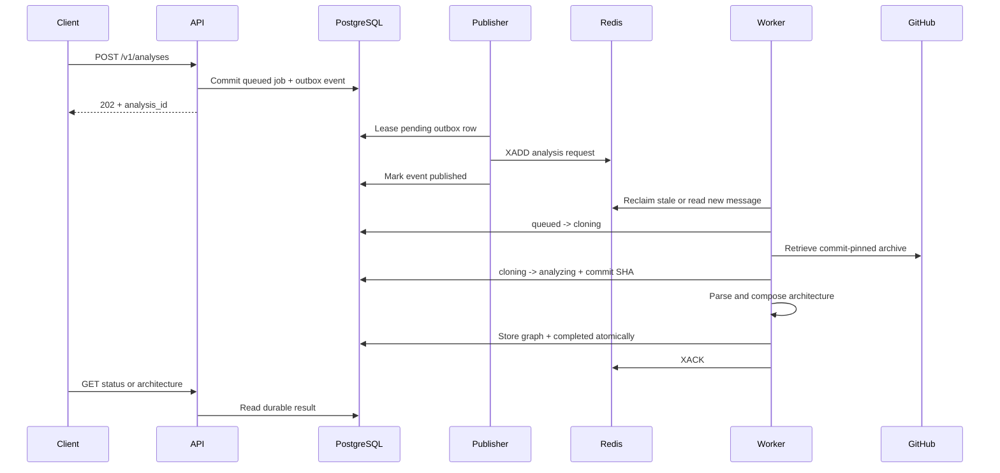

# Analysis runtime wiring

- **Status:** Implemented behind explicit configuration
- **Checkpoint:** 14
- **API mode:** Lifespan-owned publisher
- **Worker mode:** One delivery per `--once` invocation

Checkpoint 14 connects durable submission, Redis delivery, static analysis, and
result persistence without moving repository work into the API process.



## API configuration

The runtime is opt-in so imports, tests, and partially configured deployments
continue to fail closed. Configure:

```text
REPOLUME_ANALYSIS_RUNTIME_ENABLED=true
REPOLUME_DATABASE_URL=postgresql+psycopg://...
REPOLUME_REDIS_URL=redis://...
```

Optional `REPOLUME_ANALYSIS_STREAM` changes the stream name. At startup the API
builds a PostgreSQL-backed `AnalysisJobService`, starts a retrying outbox
publisher thread, and installs both through FastAPI lifespan. Shutdown stops the
thread and closes Redis and database resources.

`POST /v1/analyses` returns `202` after the job and outbox event commit. Redis
does not need to be available during that request because the publisher retries
the durable event. Without the enable flag, analysis routes keep returning the
safe `analysis_service_unavailable` response.

## Worker command

Configure the same database and Redis URLs, then process at most one message:

```bash
python -m repolume_worker --once
```

Optional worker settings are:

- `REPOLUME_ANALYSIS_STREAM`
- `REPOLUME_ANALYSIS_CONSUMER_GROUP`
- `REPOLUME_ANALYSIS_CLAIM_IDLE_MS` (defaults to 1,800,000 milliseconds)
- `REPOLUME_WORKER_CONSUMER` (defaults to `worker-1`)

The command first checks for one stale pending delivery, then waits briefly for
one new delivery. Its JSON output reports `idle`, `completed`, `failed`,
`duplicate`, `abandoned`, or `discarded` without including repository source or
secret configuration.

## Persistence and acknowledgement rules

Active pipeline transitions are compare-and-set database updates. A second
delivery that loses the initial `queued -> cloning` update is a duplicate and
is acknowledged before retrieval begins. The immutable commit SHA is persisted
when retrieval succeeds and analysis begins.

Completion changes `analyzing -> completed` and inserts the architecture in one
transaction. Controlled pipeline failures persist their safe code and message.
Only then does the worker acknowledge Redis. Availability failures are allowed
to escape without acknowledgement so consumer-group recovery can try again.

A reclaimed active attempt is marked `failed` with `analysis_abandoned`. This
is safer than silently restarting work after the original temporary repository
and in-memory state have been lost.

## Verification boundary

API tests cover durable HTTP submission, state inspection, runtime lifespan,
and publisher retries. Worker tests cover lifecycle callbacks, shared-schema
persistence, completion, controlled failure, duplicates, stale recovery,
malformed messages, and the bounded CLI.

Worker CI starts PostgreSQL 17 and Redis 8.8.1. A service-backed integration test
reads a real stream delivery, persists a real architecture transaction, and
confirms the consumer-group pending count returns to zero.

## Intentional limitations

This checkpoint does not add a forever-running worker loop, process supervisor,
heartbeat, retry backoff schedule, dead-letter stream, cancellation, progress
streaming, authentication, authorization, job ownership, rate limiting, or
production deployment configuration.