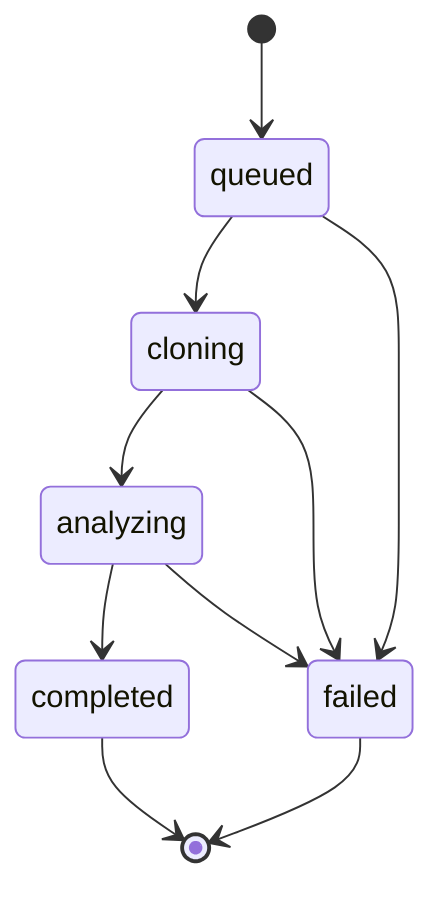

# Analysis worker lifecycle

This document defines the job-state contract shared by the analysis API and
worker. The API now exposes submission and status shapes through an injected
job-service boundary. The worker pipeline connects repository retrieval, source
analysis, architecture composition, lifecycle history, and cleanup. Redis Stream delivery and acknowledgement primitives
are implemented, but the
runtime consumer and persistent job processing are not connected yet.

## State meanings

| State | Meaning |
| --- | --- |
| `queued` | The request has been accepted but not claimed by a worker. |
| `cloning` | The worker is retrieving the approved repository source. |
| `analyzing` | Static analysis is running against the isolated source. |
| `completed` | The expected analysis artifacts were produced successfully. |
| `failed` | Processing stopped and a safe failure reason was recorded. |

## Transition rules

- Jobs move forward one successful state at a time.
- Any active state may transition to `failed`.
- `completed` and `failed` are terminal.
- A worker must reject skipped, repeated, or backward transitions.
- Retrying a failed job will create a new attempt rather than reopen a
  terminal state.

## Deferred details

- Runtime queue-to-pipeline orchestration
- Retry limits, backoff, and dead-letter policy
- Cancellation
- Progress events
- Wiring worker-produced failure codes into durable storage
