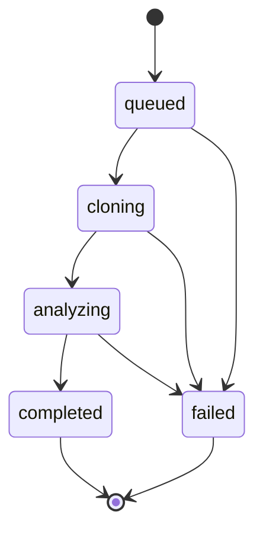

# Analysis worker lifecycle

This document defines the job-state contract shared by the planned API
submission flow and analysis worker. Repository retrieval is implemented as an
isolated worker capability, but queue delivery and complete job processing are
not connected yet.

## State meanings

| State | Meaning |
| --- | --- |
| `queued` | The request has been accepted but not claimed by a worker. |
| `cloning` | The worker is retrieving the approved repository source. |
| `analyzing` | Static analysis is running against the isolated source. |
| `completed` | The expected analysis artifacts were produced successfully. |
| `failed` | Processing stopped and a safe failure reason was recorded. |

## Transition rules

- Jobs move forward one successful state at a time.
- Any active state may transition to `failed`.
- `completed` and `failed` are terminal.
- A worker must reject skipped, repeated, or backward transitions.
- Retrying a failed job will create a new attempt rather than reopen a
  terminal state.

## Deferred details

- Queue delivery and acknowledgement behavior
- Retry limits and backoff
- Lease duration and abandoned-job recovery
- Cancellation
- Progress events
- Persistence of safe retrieval and analysis failure codes
