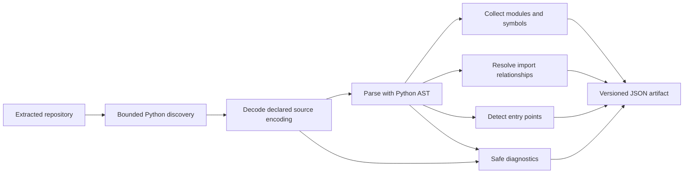

# Python static analysis

- **Status:** Implemented as an isolated worker capability
- **Checkpoint:** 7
- **Artifact schema:** 1.0

RepoLume's first source analyzer turns an extracted Python repository into a
deterministic architecture artifact. The analyzer reads source as untrusted
data and never imports modules, executes code, installs dependencies, or starts
frameworks.

## Artifact contents

The schema records:

- repository-relative Python modules and source sizes
- top-level functions, asynchronous functions, and classes
- decorator names attached to top-level symbols
- local and external import relationships
- confirmed and heuristic entry points
- exact file and line evidence for symbols, imports, and entry points
- non-fatal decode, syntax, and ambiguous-module diagnostics
- summary counts for future API and interface displays

Results are sorted before serialization and contain no temporary or absolute
machine paths. Re-analyzing the same snapshot produces the same JSON.

## Import resolution

A module name is derived from its repository-relative path. The nearest
`src/` directory is treated as a Python source root, including in monorepos,
and package `__init__.py` files represent their package.

An import is **local and confirmed** when its resolved module exists among the
successfully parsed files. Otherwise its top-level package is recorded as an
**external heuristic**. The heuristic label matters because an ignored,
generated, invalid, or dynamically supplied local module can look external.

The analyzer understands absolute imports and standard relative imports. It
does not execute custom import hooks or inspect installed packages.

## Entry points

The first version records:

- `__main__.py` modules as confirmed module entry points
- top-level `if __name__ == "__main__"` blocks as confirmed main guards
- an unguarded top-level `main` function as a heuristic candidate

Framework routes are not promoted to entry points yet. Decorator evidence is
preserved so later framework-specific resolvers can identify routes without
changing the base artifact.

## Analysis limits

| Resource | Initial limit |
| --- | ---: |
| Python files | 5,000 |
| Total Python source | 50 MiB |
| Single Python source file | 2 MiB |
| Source path depth | 50 components |
| Source path length | 512 characters |

Dependency, virtual-environment, cache, build, and vendor directories are
ignored. Symbolic-link files and directories are skipped. A repository that
exceeds an analysis limit fails with a controlled `analysis_limit_exceeded`
code.

A file with an unsupported encoding or invalid Python syntax becomes a safe
diagnostic, allowing healthy files in the same repository to remain useful.
When files from separate source roots resolve to the same Python module name,
the ambiguous files are excluded and each receives a diagnostic instead of
creating colliding graph nodes.

## Intentional limitations

This checkpoint does not include:

- nested symbol or method-level call graphs
- dynamic imports, monkey patching, or runtime reflection
- framework-specific route and dependency injection resolution
- inferred services, databases, or deployment components
- TypeScript or JavaScript analysis
- queue delivery, persistence, API submission, or UI visualization

These boundaries keep the first artifact explainable and testable. Later
language analyzers can produce the same common relationship and evidence
contracts without coupling the graph to Python's parser.
