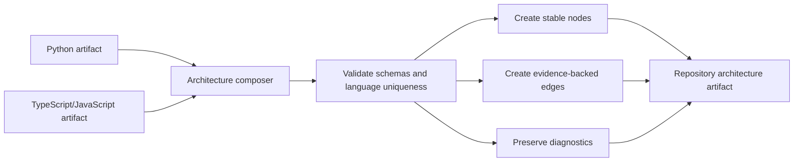

# Repository architecture artifact

- **Status:** Implemented as an isolated worker capability
- **Checkpoint:** 9
- **Artifact schema:** 1.0

RepoLume can combine its Python and TypeScript/JavaScript analysis results into
one deterministic, language-neutral graph. The composer works only from
already-produced artifacts and does not read or execute repository source.



## Graph model

Every artifact has one repository root and can contain these node kinds:

| Node kind | Purpose |
| --- | --- |
| `repository` | Stable root for the analyzed snapshot |
| `module` | One successfully parsed source module |
| `symbol` | A top-level declaration owned by a module |
| `entry_point` | A confirmed or heuristic execution starting point |
| `external_dependency` | A dependency outside the successfully parsed source |

The graph uses two directed edge kinds:

| Edge kind | Meaning |
| --- | --- |
| `contains` | Repository to module, or module to symbol or entry point |
| `depends_on` | Source module to a local module or external dependency |

Containment edges are confirmed by analyzer output. Dependency and entry-point
confidence is copied from the source artifact. Evidence-bearing nodes and every
edge keep repository-relative paths and line ranges.

## Stable identity

IDs are readable, deterministic, and independent of temporary extraction
paths. Each module ID includes the analysis language and repository-relative
path. Symbols and entry points also include their source line and declaration
kind or name.

Examples:

```text
module:python:backend%2Fapp.py
module:typescript-javascript:frontend%2Fapp.ts
symbol:python:backend%2Fservice.py:1:Service
external:typescript-javascript:react
```

Language namespaces prevent a Python module, script module, or package with the
same name from overwriting another graph node. External dependencies remain
separate by ecosystem instead of assuming that equal package names represent
the same software.

Nodes, edges, diagnostics, and language names are sorted before serialization.
An analyzer with no modules or diagnostics does not add a detected repository
language. Supplying the same artifacts in a different order produces identical
JSON.

## Composition rules

The composer:

- accepts at most one artifact for each analysis language
- accepts analysis artifact schema version `1.0`
- requires every dependency source and entry point to reference an existing
  module
- requires confirmed local dependency targets to exist in the same language
  artifact
- creates unique external dependency nodes for heuristic external targets
- preserves source sizes, line counts, symbol kinds, decorators, diagnostics,
  source evidence, and confidence
- reports summary counts for languages, nodes, edges, modules, symbols, entry
  points, external dependencies, dependency edges, and diagnostics

Invalid internal artifacts fail composition instead of producing dangling graph
edges.

## Mixed-language boundary

Python and TypeScript/JavaScript nodes can coexist in one artifact, but
Checkpoint 9 does not invent cross-language dependencies. A future resolver may
connect a frontend request to a Python API only when repository evidence such
as routes, generated clients, configuration, or API contracts supports it.

This distinction keeps the graph explainable: coexistence is confirmed by
source discovery, while a relationship requires its own evidence.

## Intentional limitations

Checkpoint 9 does not include:

- service or component clustering
- framework route extraction
- cross-language API matching
- method-level call graphs
- databases, queues, deployment resources, or infrastructure inference
- architecture scoring or design recommendations
- persistence, API submission, UI visualization, or AI features

The artifact is an internal worker capability until the analysis pipeline and
storage boundaries are implemented.
