# Repository retrieval

- **Status:** Implemented as an isolated worker capability
- **Checkpoint:** 6

The worker can retrieve a public GitHub repository snapshot after the API has
normalized its owner, repository, and optional ref. This capability is not yet
connected to an API submission endpoint or queue.

```mermaid
flowchart LR
    A["Normalized repository request"] --> B["Verify public repository"]
    B --> C["Resolve ref to commit SHA"]
    C --> D["Request archive from api.github.com"]
    D --> E["Validate codeload.github.com redirect"]
    E --> F["Stream bounded tarball"]
    F --> G["Inspect every archive entry"]
    G --> H["Extract regular files into temporary storage"]
    H --> I["Bounded static analysis"]
    I --> J["Always remove temporary source"]
```

## Network boundary

- Requests are constructed from normalized coordinates; the submitted URL is
  never requested.
- Repository metadata and commit resolution use the fixed
  `https://api.github.com` origin.
- The requested ref is resolved to a full 40-character commit SHA before the
  archive is requested.
- Automatic redirects are disabled.
- The one archive redirect must use HTTPS, have no credentials, port, query,
  fragment, or encoded path, and match the expected repository and commit on
  `codeload.github.com`.
- The production client ignores proxy and credential settings inherited from
  the process environment.
- Connections use bounded connect, read, write, and pool timeouts.

## Enforced limits

| Resource | Initial limit |
| --- | ---: |
| Compressed archive | 50 MiB |
| Expanded regular-file data | 250 MiB |
| Single regular file | 20 MiB |
| Archive entries | 25,000 |
| Repository path depth | 50 components |
| Repository path length | 512 characters |

Both the declared `Content-Length` and the number of bytes actually streamed
are checked. The extractor independently checks the compressed archive size.

## Archive boundary

The entire archive table is inspected before the first file is written. The
extractor accepts only regular files and directories under one archive root. It
rejects:

- absolute paths, parent traversal, backslashes, control characters, and
  unsupported Windows paths
- symbolic links, hard links, devices, FIFOs, and other special entries
- duplicate paths, case-insensitive collisions, and file/directory conflicts
- files, totals, entry counts, path depths, or path lengths beyond the limits
- corrupt, truncated, empty, or multi-root archives

File ownership, permissions, timestamps, and executable bits from the archive
are not applied. Repository code is stored as data and is never imported,
executed, built, or installed.

## Lifetime and failures

The retrieved snapshot is exposed through a context manager. Its archive is
removed immediately after extraction, and its temporary directory is removed
when processing succeeds, fails, or the context exits. Cleanup failures become
controlled worker errors rather than raw operating-system messages.

Failure codes are safe to store with future analysis jobs. They distinguish
missing repositories or refs, GitHub availability and rate limits, rejected
redirects, archive limits, unsafe archives, download failures, and cleanup
failures without including response bodies or source contents.

## Deferred integration

- API analysis submission
- Queue delivery and worker claims
- Database persistence and retention records
- Container-level outbound network policy
