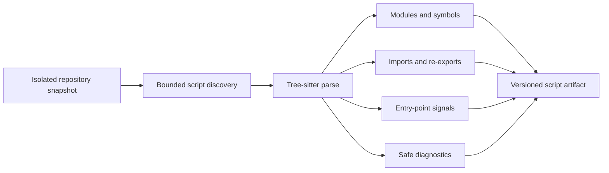

# TypeScript and JavaScript static analysis

- **Status:** Implemented as an isolated worker capability
- **Checkpoint:** 8
- **Artifact schema:** 1.0

The worker can inspect TypeScript and JavaScript repositories without running
their code or installing their packages. It produces a deterministic artifact
that can later feed RepoLume's architecture graph.

## Supported source

The analyzer reads `.ts`, `.tsx`, `.js`, `.jsx`, `.mts`, `.cts`,
`.mjs`, `.cjs`, and `.d.ts` files. TypeScript and JavaScript use the
TypeScript Tree-sitter grammar; TSX and JSX use its TSX grammar.

Generated and dependency directories such as `node_modules`, `dist`,
`build`, `coverage`, `.next`, and `.turbo` are skipped.

## Artifact contents

The version 1 script artifact contains:

- repository-relative modules with language, byte count, line count, and
  top-level symbols
- functions, async functions, classes, variables, interfaces, type aliases,
  enums, and decorators
- ES imports and re-exports, CommonJS `require`, and dynamic `import()`
  relationships
- confirmed local dependencies and heuristic external-package dependencies
- confirmed `require.main === module` entry points and heuristic conventional
  root files or top-level `main` functions
- non-fatal diagnostics for files that cannot be decoded or parsed
- summary counts for modules, symbols, dependencies, entry points, and
  diagnostics

Relative imports resolve against discovered source files, including index
modules and common runtime `.js` specifiers that point to TypeScript source.
Scoped packages keep their package root, such as `@scope/client`.

All paths in the artifact are repository-relative. Output ordering and JSON
serialization are stable so later checkpoints can persist or compare results.

## Resource and trust boundary

The default limits are 5,000 script files, 50 MiB of source in total, 2 MiB per
file, 50 path components, and 512 characters per path. Invalid limits fail
during configuration.

Repository source is always treated as data. The analyzer does not execute
scripts, import repository modules, run package managers, read `package.json`
hooks, or invoke a compiler. Tree-sitter and its TypeScript grammar are worker
dependencies, not dependencies supplied by the repository.

## Confidence

A relationship is `confirmed` when its target matches a discovered local
module. External dependencies and convention-based entry points are
`heuristic` because source syntax alone cannot prove their runtime behavior.
Every finding includes a repository-relative source location.

## Deferred work

Checkpoint 8 intentionally does not include:

- `tsconfig.json` path aliases, `baseUrl`, or workspace package resolution
- framework-specific routes and entry points
- package export-map or bundler configuration resolution
- call graphs, runtime reflection, or dead-code analysis
- merging Python and script artifacts into one architecture graph
- queue delivery, persistence, API submission, UI, or AI features

These boundaries keep the parser useful and testable before the product layers
are connected.

## Parser references

- [Tree-sitter Python bindings](https://tree-sitter.github.io/py-tree-sitter/)
- [Tree-sitter TypeScript grammar](https://pypi.org/project/tree-sitter-typescript/)
